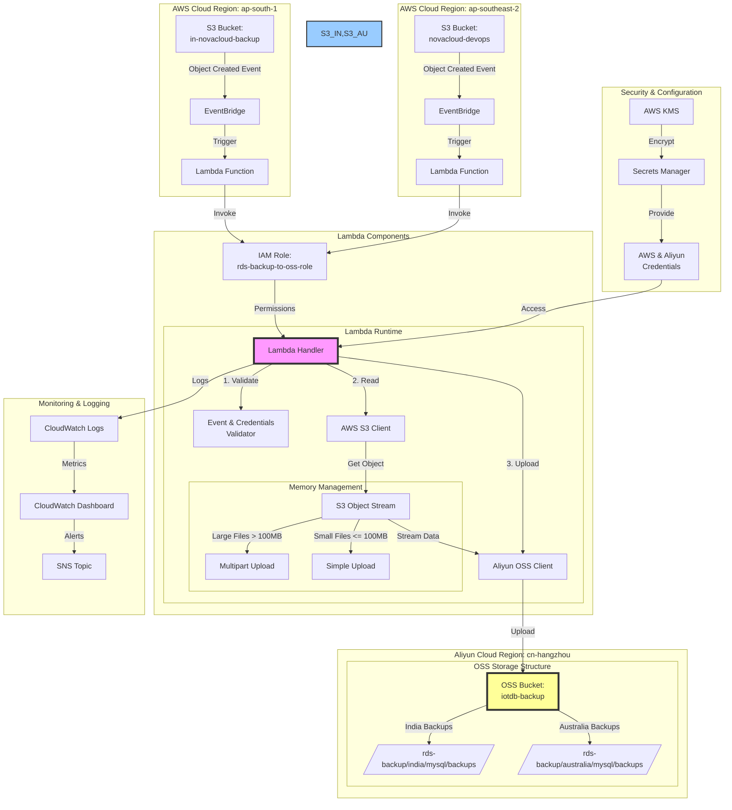

查看日志
 aws logs tail "/aws/lambda/rds-backup-to-oss" --follow

 更新函数

cd src
zip -r ../function.zip .
cd ..

aws lambda update-function-code \
    --function-name rds-backup-to-oss \
    --zip-file fileb://function.zip \
    --region ap-southeast-2

测试函数
aws lambda invoke --function-name rds-backup-to-oss --payload '{"Records": [{"s3": {"bucket": {"name": "iotdb-backup"}, "object": {"key": "rds-backup/australia/2024-11-13/iotdb-backup-2024-11-13-16-59-59.sql.gz"}}}]}' response.txt
部署函数
./scripts/update-function.sh

# 报错处理
## 确实配置
root - ERROR - Configuration error: No S3 bucket configured for region:

root - ERROR - Configuration error: Missing required environment variables: ALIYUN_ACCESS_KEY, ALIYUN_SECRET_KEY

## 缺少权限
 这个错误表明 Lambda 函数的 IAM 角色缺少 KMS 解密权限。
 Failed to download file from S3: An error occurred (AccessDenied) when calling the GetObject operation: User: arn:aws:sts::059012766390:assumed-role/rds-backup-to-oss-role/rds-backup-to-oss is not authorized to perform: kms:Decrypt on resource: arn:aws:kms:ap-southeast-2:059012766390:key/22584e80-f470-4c1a-9998-7e84cccf2b01 because no identity-based policy allows the kms:Decrypt action

 获取角色 ARN
ROLE_ARN=$(aws lambda get-function \
    --function-name rds-backup-to-oss \
    --query 'Configuration.Role' \
    --output text)

显示角色策略
aws iam list-attached-role-policies \
    --role-name $(echo $ROLE_ARN | cut -d'/' -f2)

# 架构

